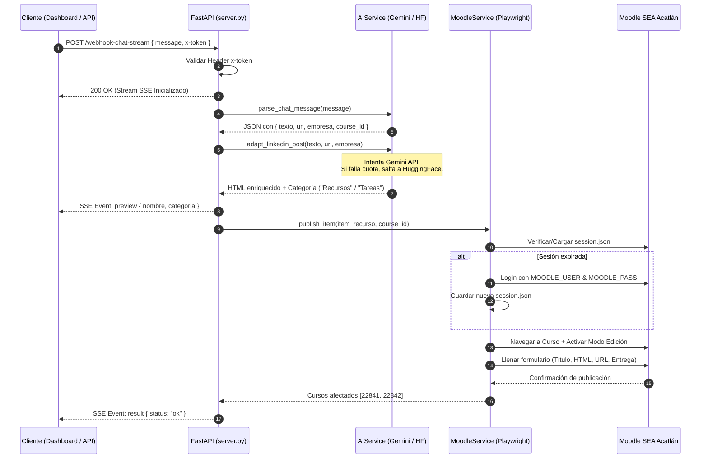

# 📘 Documentación Técnica General — Moodi (Agente Moodle SEA Acatlán)

## 1. Visión General del Sistema

**Moodi** es una solución empresarial/académica basada en **FastAPI**, **IA Generativa Híbrida (Gemini + Hugging Face)** y **Automatización de Procesos Robóticos (RPA con Playwright)**. 

Su función principal es ingerir contenido técnico no estructurado (enlaces a eventos, cursos, diplomados, vacantes o publicaciones de LinkedIn), procesarlo pedagógicamente y crearlo automáticamente como recurso o tarea en la plataforma Moodle **SEA FES Acatlán (UNAM)**.

---

## 2. Arquitectura de Componentes

```text
[ Cliente / Frontend ]
       │  (Petición HTTP / SSE Stream)
       ▼
┌─────────────────────────────────────────────────────────┐
│                    FastAPI Server                       │
│  - SanitizedJSONRoute (Sanitización JSON estricta=False)│
│  - Middleware CORS & Endpoints Asíncronos               │
└───────────┬─────────────────────────────────────────────┘
            │
            ├──────────────────────────┐
            ▼                          ▼
┌──────────────────────┐   ┌────────────────────────────────┐
│      AIService       │   │         MoodleService          │
│ - Gemini API Pool    │   │ - Playwright Browser Context   │
│ - HuggingFace Pool   │   │ - Session Manager Cookies      │
│ - Guardián RateLimit │   │ - Form Filling & Page Actions  │
└──────────────────────┘   └────────────────────────────────┘
```

### Módulos Principales:

1. **`server.py` (Capa de API & Routing):**
   * Configura FastAPI con `SanitizedJSONRoute` para permitir JSONs con saltos de línea sin escapar crudos de cURL o Swagger.
   * Maneja el streaming en tiempo real (Server-Sent Events) utilizando `queue.Queue` y `threading.Thread`.

2. **`app/services/ai_service.py` (Capa de Inteligencia Artificial):**
   * **Gemini API Pool:** Modelos `gemini-2.0-flash`, `gemini-1.5-flash-002`, `gemini-1.5-pro-002`.
   * **HuggingFace Fallback Pool:** Modelos `Qwen2.5-72B`, `Llama-3.3-70B`, `Mistral-Nemo`.
   * **Rate Limit Guard:** Pausa preventiva de 4.5s entre llamadas para cumplir la cuotas de 15 RPM en cuentas comunitarias de Gemini.

3. **`app/services/moodle_service.py` (Capa RPA & Playwright):**
   * Automatización del navegador Chromium en modo `headless`.
   * Gestión del archivo `session.json` para reutilización de cookies de sesión sin hacer login en cada ejecución.
   * Interacción directa con el DOM de Moodle para crear actividades `recurso_url` y `tarea_assign`.

4. **`app/config.py` & `app/models.py` (Capa de Datos & Configuración):**
   * Modelos Pydantic (`LinkedInPayload`, `ChatPayload`, `RecursoItem`) para validación estricta de entradas y respuestas.
   * Configuración global cargada mediante `python-dotenv`.

---

## 3. Seguridad y Buenas Prácticas para Repositorio Público

Dado que este proyecto será publicado en GitHub de forma pública, se implementaron y deben seguirse los siguientes lineamientos de seguridad:

### 🔒 Checklist de Seguridad Obligatorio:

1. **Aislamiento de Secretos (`.env`):**
   * **NUNCA** subir el archivo `.env` al repositorio. Se encuentra correctamente incluido en `.gitignore`.
   * Proveer siempre `.env.example` con valores genéricos de demostración.

2. **Protección de Sesiones e Historiales:**
   * Los archivos `session.json` (cookies de autenticación en Moodle) y `recursos.json` están excluidos en `.gitignore`.
   * Se añadieron patrones para ignorar entornos virtuales (`.venv/`, `venv/`), imágenes de depuración (`*.png`) y logs.

3. **Autenticación en la API (`x-token`):**
   * Todos los endpoints sensibles (`/webhook-linkedin`, `/webhook-linkedin-stream`, `/webhook-chat-stream`) requieren el encabezado `x-token` coincidente con `API_SECRET`.
   * En producción, asegúrate de configurar un `API_SECRET` complejo y único en el panel de Render/Vercel.

4. **Sanitización de Datos y XSS:**
   * El código HTML generado por la IA es encapsulado en un contenedor limpio antes de inyectarse en Moodle.
   * Se sanitizan las URLs para prevenir inyecciones maliciosas (`javascript:` o rutas no válidas).

---

## 4. Flujo de Ejecución Detallado (Paso a Paso)



---

## 5. Mantenimiento y Resolución de Problemas (Troubleshooting)

### Error 401 Unauthorized
* **Causa:** El encabezado `x-token` enviado en la petición no coincide con `API_SECRET` definido en `.env`.
* **Solución:** Revisa los encabezados en cURL, Postman o la interfaz de Vercel.

### Error 422 Invalid Control Character
* **Causa:** El cuerpo JSON contiene saltos de línea crudos sin escapar `\n`.
* **Solución:** Ya está resuelto automáticamente mediante la clase `SanitizedJSONRoute` en `server.py`.

### Sesión de Moodle Expirada o Bloqueada
* **Causa:** Moodle cerró la sesión activa.
* **Solución:** Si experimentas problemas de autenticación, elimina el archivo local `session.json` y el agente volverá a autenticarse automáticamente en la siguiente ejecución.

---

## 6. Despliegue en Producción

### Render (Backend API)
1. Conecta el repositorio a Render como **Web Service**.
2. Selecciona el entorno **Docker** (detectará automáticamente el `Dockerfile`).
3. Agrega las variables de entorno en el panel de Render:
   * `MOODLE_USER`, `MOODLE_PASS`, `MOODLE_COURSE_ID`, `API_SECRET`, `GEMINI_API_KEY`, `HF_TOKEN`, `RENDER=true`.

### Vercel (Frontend UI)
1. Conecta el repositorio de la interfaz web a Vercel.
2. Configura la URL base del backend apuntando a tu instancia de Render (`https://tu-app.onrender.com`).
