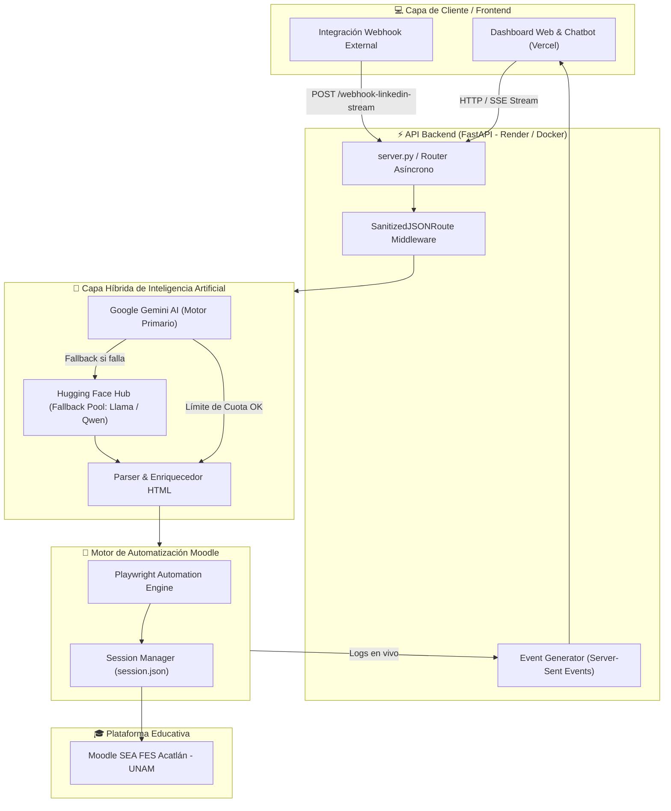

# 🤖 Moodi — Agente de Automatización Moodle con IA (SEA FES Acatlán - UNAM)

[](https://fastapi.tiangolo.com/)
[](https://playwright.dev/)
[](https://ai.google.dev/)
[](https://huggingface.co/)
[](LICENSE)

**Moodi** es un agente inteligente autónomo diseñado para la **FES Acatlán (UNAM)** que transforma publicaciones técnicas, enlaces web y anuncios de LinkedIn en recursos pedagógicos y tareas estructuradas dentro de aulas virtuales de Moodle en segundos.

---

## 🌟 Características Principales

### 🧠 Backend e Inteligencia Artificial
* **Arquitectura IA Híbrida con Fallback:**
  * **Motor Principal:** Google Gemini AI (`gemini-2.0-flash`, `gemini-1.5-flash`).
  * **Motor Secundario (Fallback Pool):** Hugging Face Inference API (`Qwen/Qwen2.5-72B`, `Llama-3.3-70B`, `Mistral-Nemo`) que se activa automáticamente en milisegundos si Gemini agota su límite de cuota (*Rate Limit Guard*).
* **Clasificación Pedagógica Automática:** Identifica si el contenido debe publicarse como un **Recurso de Lectura/Enlace** (`recurso_url`) o como una **Tarea/Actividad Entregable** (`tarea_assign`).
* **Formateo HTML Enriquecido:** Genera descripciones dinámicas con badges de tecnologías (`#Python`, `#IA`), consignas claras, logos corporativos e incrustación de publicaciones de LinkedIn vía `iframe`.

### 🤖 Navegación Robótica (RPA con Playwright)
* **Acceso Autónomo sin APIs Restrictivas:** Realiza navegación automatizada simulando la interacción de un docente real sobre Moodle.
* **Persistencia de Sesión:** Guarda cookies de autenticación (`session.json`) para evitar re-logins innecesarios y optimizar el rendimiento.
* **Gestión Multi-Curso:** Publica de forma simultánea en múltiples cursos o secciones según la configuración.

### 💻 Frontend & Interfaz de Usuario
* **Dashboard Interactivo & Chatbot:** Interfaz web intuitiva que permite a los docentes ingresar posts o chatear con Modi.
* **Streaming de Logs en Vivo (Server-Sent Events - SSE):** Retroalimentación instantánea paso a paso (`Analizando IA`, `Autenticando`, `Modo Edición`, `Publicado`).
* **Sanitización de Datos Customizada:** Middleware en FastAPI que permite procesar entradas JSON con saltos de línea crudos sin arrojar errores `422 Unprocessable Entity`.

---

## 🏗️ Arquitectura del Sistema



---

## 🛠️ Tecnologías Utilizadas

| Componente | Tecnología | Descripción |
| :--- | :--- | :--- |
| **Backend** | Python 3.11 + FastAPI + Uvicorn | API web asíncrona de alta velocidad. |
| **IA Principal** | Google Gemini API (2.0 / 1.5) | Extracción, clasificación JSON y formateo HTML. |
| **IA Respaldo** | Hugging Face Inference API | Modelos Open-Source 70B+ como fallback resiliente. |
| **RPA / Scraping** | Playwright (Headless Browser) | Automatización del navegador e interacción con Moodle. |
| **Streaming** | SSE (Server-Sent Events) | Transmisión de estado de la consola en tiempo real. |
| **Frontend** | HTML5 / JavaScript Vanilla / Tailwind CSS | Dashboard interactivo ligero desplegado en Vercel. |
| **Contenedor** | Docker / Render / Ngrok | Infraestructura cloud lista para producción a costo $0. |

---

## 🛰️ Rutas de la API (Endpoints)

### 1. Estado del Servicio
* `GET /`
  * **Respuesta:** Estado de conexión de la API y lista de IDs de cursos Moodle configurados.

### 2. Webhook LinkedIn (Síncrono)
* `POST /webhook-linkedin`
  * **Headers:** `x-token: <API_SECRET>`
  * **Payload:**
    ```json
    {
      "texto": "Post informativo sobre becas STEM...",
      "url": "https://becalos.mx/formulario",
      "linkedin_url": "https://www.linkedin.com/posts/...",
      "empresa": "Bécalos",
      "seccion": 0,
      "course_id": 22841
    }
    ```

### 3. Webhook LinkedIn con Logs en Vivo (Streaming)
* `POST /webhook-linkedin-stream`
  * **Headers:** `x-token: <API_SECRET>`
  * **Respuesta:** Stream en formato `text/event-stream` con eventos JSON (`log`, `result`, `error`).

### 4. Webhook Chatbot Inteligente (Streaming)
* `POST /webhook-chat-stream`
  * **Headers:** `x-token: <API_SECRET>`
  * **Payload:**
    ```json
    {
      "message": "Hola Modi, publica este taller de Python https://airtable.com/form para la empresa Google en la sección 1"
    }
    ```

---

## ⚙️ Variables de Entorno (`.env`)

Crea un archivo `.env` en la raíz del proyecto basándote en `.env.example`:

```env
# Configuración Moodle SEA Acatlán
MOODLE_BASE_URL=https://sea.acatlan.unam.mx
MOODLE_USER=tu_usuario_moodle
MOODLE_PASS=tu_contraseña_moodle
MOODLE_COURSE_ID=22841,22842

# Seguridad de la API
API_SECRET=tu_clave_secreta_webhook

# Claves de Inteligencia Artificial
GEMINI_API_KEY=tu_gemini_api_key
HF_TOKEN=tu_huggingface_token

# Opcional (Túnel Local)
NGROK_AUTHTOKEN=tu_ngrok_token
```

---

## 🚀 Instalación y Ejecución Local

### 1. Clonar el repositorio
```bash
git clone https://github.com/tu-usuario/AgentAutomationMoodle.git
cd AgentAutomationMoodle
```

### 2. Crear entorno virtual e instalar dependencias
```bash
python -m venv venv
# En Windows:
venv\Scripts\activate
# En Linux/Mac:
source venv/bin/activate

pip install -r requirements.txt
playwright install chromium
```

### 3. Iniciar el Servidor Backend
```bash
python server.py
```
El servidor se iniciará en `http://localhost:8000`. Si estás en entorno local, abrirá automáticamente un túnel seguro con **Ngrok**.

---

## 🐳 Despliegue con Docker

Puedes construir y ejecutar la imagen oficial con Docker:

```bash
# Construir imagen
docker build -t moodi-agent .

# Ejecutar contenedor
docker run -d -p 8000:8000 --env-file .env --name moodi-container moodi-agent
```

---

## ☁️ Arquitectura Cloud a Costo $0 USD

El proyecto está optimizado para funcionar **100% gratis** en entornos de producción:
* **Backend:** Desplegado en **Render** (*Web Service / Docker Container*).
* **Frontend:** Desplegado en **Vercel** (*Static Dashboard UI*).
* **IA Layer:** Capa de cuota gratuita de **Google AI Studio** + **Hugging Face Inference Hub**.

---

## 📄 Licencia

Este proyecto está bajo la licencia MIT. Desarrollado para la **FES Acatlán - UNAM**.
