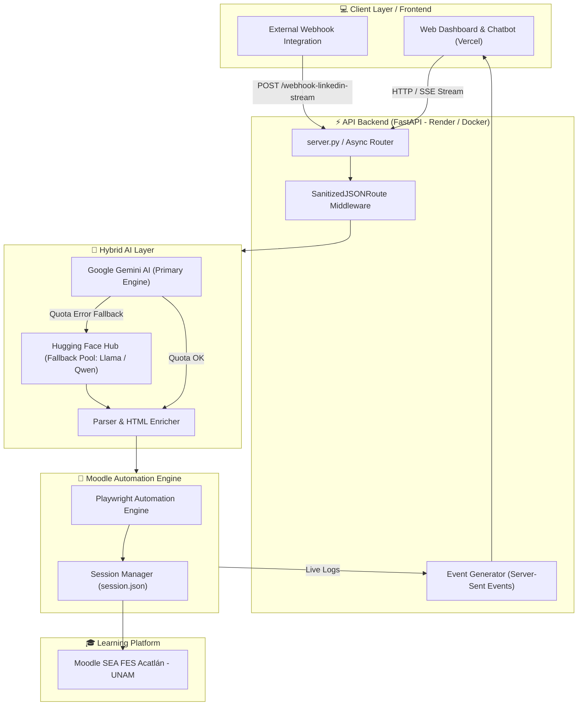

# 🤖 Moodi — Moodle AI Automation Agent (SEA FES Acatlán - UNAM)

[](https://fastapi.tiangolo.com/)
[](https://playwright.dev/)
[](https://ai.google.dev/)
[](https://huggingface.co/)
[](LICENSE)

**Moodi** is an autonomous intelligent agent developed for **FES Acatlán (UNAM)** that transforms technical publications, web links, and LinkedIn announcements into structured pedagogical resources and assignments inside Moodle virtual classrooms in seconds.

---

## 🌟 Key Features

### 🧠 Backend & Artificial Intelligence
* **Hybrid AI Architecture with Fallback:**
  * **Primary Engine:** Google Gemini AI (`gemini-2.0-flash`, `gemini-1.5-flash`).
  * **Secondary Engine (Fallback Pool):** Hugging Face Inference API (`Qwen/Qwen2.5-72B`, `Llama-3.3-70B`, `Mistral-Nemo`) that automatically triggers in milliseconds if Gemini hits its quota limits (*Rate Limit Guard*).
* **Automatic Pedagogical Classification:** Identifies whether content should be published as a **Reading Resource/URL** (`recurso_url`) or a **Graded Assignment** (`tarea_assign`).
* **Enriched HTML Formatting:** Generates dynamic descriptions featuring tech badges (`#Python`, `#AI`), instructions, corporate logos, and embedded LinkedIn posts via `iframe`.

### 🤖 Robotic Process Automation (Playwright RPA)
* **Autonomous Access without Restrictive APIs:** Performs browser automation simulating real faculty interaction on Moodle.
* **Session Persistence:** Saves authentication cookies (`session.json`) to prevent redundant logins and speed up execution.
* **Multi-Course Management:** Simultaneously publishes across multiple courses or sections based on configuration.

### 💻 Frontend & User Interface
* **Interactive Dashboard & Chatbot:** Intuitive web interface enabling instructors to submit posts or interact with Modi.
* **Live Log Streaming (Server-Sent Events - SSE):** Step-by-step real-time execution logs (`Analyzing AI`, `Authenticating`, `Editing Mode`, `Published`).
* **Custom Data Sanitization:** Custom FastAPI middleware to handle raw unescaped JSON inputs without `422 Unprocessable Entity` errors.

---

## 🏗️ System Architecture



---

## 🛠️ Tech Stack

| Component | Technology | Description |
| :--- | :--- | :--- |
| **Backend** | Python 3.11 + FastAPI + Uvicorn | High-performance asynchronous Web API. |
| **Primary AI** | Google Gemini API (2.0 / 1.5) | Extraction, JSON classification & HTML formatting. |
| **Backup AI** | Hugging Face Inference API | Open-Source 70B+ LLM Models for resilient fallback. |
| **RPA / Automation** | Playwright (Headless Browser) | Browser automation & DOM manipulation on Moodle. |
| **Streaming** | SSE (Server-Sent Events) | Real-time console log transmission. |
| **Frontend** | HTML5 / Vanilla JS / Tailwind CSS | Lightweight interactive dashboard hosted on Vercel. |
| **Deployment** | Docker / Render / Ngrok | Production-ready zero-cost cloud architecture. |

---

## ⚙️ Environment Variables (`.env`)

Create a `.env` file in the root directory based on `.env.example`:

```env
# Moodle SEA Acatlán Config
MOODLE_BASE_URL=https://sea.acatlan.unam.mx
MOODLE_USER=your_moodle_username
MOODLE_PASS=your_moodle_password
MOODLE_COURSE_ID=22841,22842

# API Security Secret
API_SECRET=your_webhook_secret_key

# AI API Keys
GEMINI_API_KEY=your_gemini_api_key
HF_TOKEN=your_huggingface_token

# Optional (Local Dev Tunnel)
NGROK_AUTHTOKEN=your_ngrok_authtoken
```

---

## 🚀 Local Installation & Setup

### 1. Clone the repository
```bash
git clone https://github.com/your-username/AgentAutomationMoodle.git
cd AgentAutomationMoodle
```

### 2. Create a virtual environment and install dependencies
```bash
python -m venv venv
# On Windows:
venv\Scripts\activate
# On Linux/Mac:
source venv/bin/activate

pip install -r requirements.txt
playwright install chromium
```

### 3. Start the Backend Server
```bash
python server.py
```
The server will launch at `http://localhost:8000`. In a local environment, it automatically configures a secure **Ngrok** tunnel.

---

## 📄 License

This project is licensed under the MIT License. Developed for **FES Acatlán - UNAM**.
