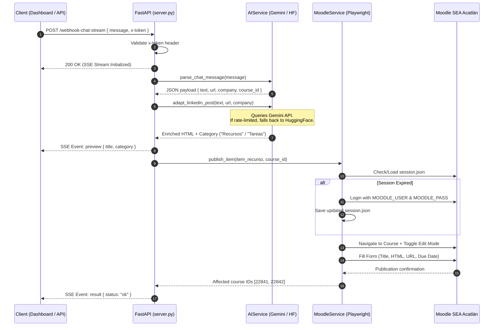

# 📘 Technical Documentation — Moodi (Moodle SEA Acatlán AI Agent)

## 1. System Overview

**Moodi** is an enterprise/academic solution built with **FastAPI**, **Hybrid Generative AI (Gemini + Hugging Face)**, and **Robotic Process Automation (RPA with Playwright)**.

Its core function is to ingest unstructured technical content (links to events, courses, scholarships, job postings, or LinkedIn publications), process it from a pedagogical perspective, and automatically publish it as a resource or assignment within the Moodle platform at **SEA FES Acatlán (UNAM)**.

---

## 2. Component Architecture

```text
[ Client / Frontend ]
       │  (HTTP Request / SSE Stream)
       ▼
┌─────────────────────────────────────────────────────────┐
│                    FastAPI Server                       │
│  - SanitizedJSONRoute (Strict=False JSON Sanitization)  │
│  - CORS Middleware & Async Endpoints                    │
└───────────┬─────────────────────────────────────────────┘
            │
            ├──────────────────────────┐
            ▼                          ▼
┌──────────────────────┐   ┌────────────────────────────────┐
│      AIService       │   │         MoodleService          │
│ - Gemini API Pool    │   │ - Playwright Browser Context   │
│ - HuggingFace Pool   │   │ - Session Manager Cookies      │
│ - RateLimit Guard    │   │ - Form Filling & Page Actions  │
└──────────────────────┘   └────────────────────────────────┘
```

### Main Modules:

1. **`server.py` (API & Routing Layer):**
   * Configures FastAPI with `SanitizedJSONRoute` to parse JSON payloads containing unescaped raw newlines from cURL or Swagger without triggering 422 validation errors.
   * Handles real-time streaming (Server-Sent Events) via `queue.Queue` and `threading.Thread`.

2. **`app/services/ai_service.py` (Artificial Intelligence Layer):**
   * **Gemini API Pool:** Primary models `gemini-2.0-flash`, `gemini-1.5-flash-002`, `gemini-1.5-pro-002`.
   * **HuggingFace Fallback Pool:** Open-Source models `Qwen2.5-72B`, `Llama-3.3-70B`, `Mistral-Nemo`.
   * **Rate Limit Guard:** Preventive 4.5s pause between API calls to stay strictly within Gemini's 15 RPM community tier limit.

3. **`app/services/moodle_service.py` (RPA & Playwright Layer):**
   * Headless Chromium browser automation.
   * Manages authentication persistence (`session.json`) to reuse session cookies and avoid redundant logins.
   * Interacts directly with the Moodle DOM to create `recurso_url` (URL resources) and `tarea_assign` (Assignments).

4. **`app/config.py` & `app/models.py` (Data & Configuration Layer):**
   * Pydantic models (`LinkedInPayload`, `ChatPayload`, `RecursoItem`) for strict request validation and response schema definition.
   * Global configuration loaded securely via `python-dotenv`.

---

## 3. Security & Open-Source Best Practices

Since this repository is intended for public distribution on GitHub, the following security protocols are implemented:

### 🔒 Mandatory Security Checklist:

1. **Secrets Isolation (`.env`):**
   * **NEVER** commit the `.env` file to the repository. It is explicitly listed in `.gitignore`.
   * Always provide `.env.example` containing non-sensitive demonstration placeholders.

2. **Session & History Protection:**
   * `session.json` (Moodle authentication cookies) and `recursos.json` are excluded via `.gitignore`.
   * Patterns are included to ignore virtual environments (`.venv/`, `venv/`), debug screenshots (`*.png`), and log files.

3. **API Authentication (`x-token`):**
   * All protected endpoints (`/webhook-linkedin`, `/webhook-linkedin-stream`, `/webhook-chat-stream`) enforce header validation against `API_SECRET`.
   * In production deployments, ensure a unique, cryptographically secure `API_SECRET` is configured in the cloud dashboard (Render/Vercel).

4. **Data Sanitization & XSS Prevention:**
   * AI-generated HTML content is encapsulated within sanitized containers before insertion into Moodle.
   * External destination URLs are validated to prevent malicious protocol injections (`javascript:` or invalid routes).

---

## 4. End-to-End Execution Flow



---

## 5. Maintenance & Troubleshooting

### 401 Unauthorized Error
* **Cause:** The `x-token` header provided in the HTTP request does not match `API_SECRET` in `.env`.
* **Solution:** Verify header values in cURL, Postman, or your Vercel Dashboard client.

### 422 Invalid Control Character Error
* **Cause:** The JSON body contains unescaped raw newlines (`\n`).
* **Solution:** Handled automatically by `SanitizedJSONRoute` custom route handler in `server.py`.

### Expired or Invalid Moodle Session
* **Cause:** Moodle invalidated the active session token.
* **Solution:** Delete the local `session.json` file. The agent will re-authenticate automatically on the next execution cycle.

---

## 6. Cloud Production Deployment

### Render (Backend API)
1. Connect repository to Render as a **Web Service**.
2. Select **Docker** environment (Render auto-detects `Dockerfile`).
3. Set environment variables in the Render Dashboard:
   * `MOODLE_USER`, `MOODLE_PASS`, `MOODLE_COURSE_ID`, `API_SECRET`, `GEMINI_API_KEY`, `HF_TOKEN`, `RENDER=true`.

### Vercel (Frontend UI)
1. Deploy static dashboard interface on Vercel.
2. Set API base endpoint pointing to your active Render instance (`https://your-app.onrender.com`).
